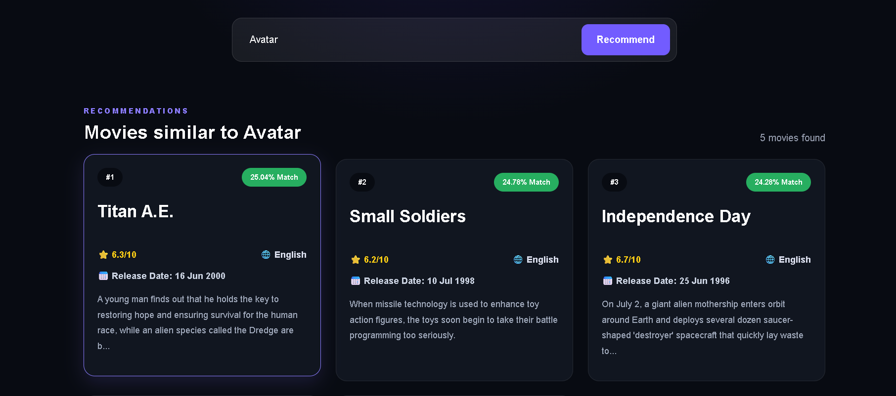

# Movie-Recommendation-System
A Content-Based Movie Recommendation System built using React, Flask, Python, and Machine Learning. The application recommends similar movies based on genres, cast, keywords, and movie descriptions using Cosine Similarity.

---

## 🚀 Features

- Search any movie
- Get Top 5 similar movie recommendations
- Similarity Match Percentage
- Movie Rating
- Language
- Release Date
- Movie Overview
- Responsive UI
- Fast Recommendation Engine

---

## 🛠️ Tech Stack

### Frontend
- React (Vite)
- CSS
- Axios

### Backend
- Flask
- Flask-CORS

### Machine Learning
- Python
- Pandas
- Scikit-learn
- CountVectorizer
- Cosine Similarity

---

## 📂 Project Structure

Movie-Recommendation-System/

├── backend/

│ ├── app.py

│ └── requirements.txt

├── frontend/

│ ├── src/

│ ├── public/

│ └── package.json

├── model/

│ ├── movies.pkl

│ └── similarity.pkl

└── README.md

---

## ⚙️ Installation

### Clone Repository

```bash
git clone https://github.com/SrinathR93/Movie-Recommendation-System.git
```

### Backend

```bash
cd backend
pip install -r requirements.txt
python app.py
```

### Frontend

```bash
cd frontend
npm install
npm run dev
```

---

## 📸 Screenshots

### Home Page


### Recommendation Results



## 📈 Future Improvements

- Movie Posters
- User Authentication
- Favorites List
- Recommendation History
- Genre Filters
- AI Chat Assistant

---

## 👨‍💻 Author

**Srinath R**

GitHub:
https://github.com/SrinathR93
